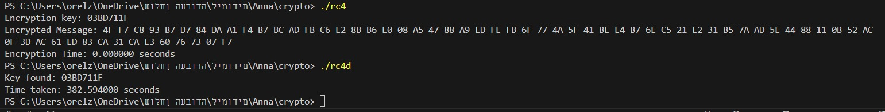

# RC4 Encryption and Brute-Force Attack

This repository contains a simple implementation of the RC4 encryption algorithm along with a demonstration of a brute-force attack to recover the encryption key.

## Contents

- [RC4 Encryption](#rc4-encryption)
- [Brute-Force Attack](#brute-force-attack)
- [Demonstration](#demonstration)
- [How to Run](#how-to-run)
- [Disclaimer](#disclaimer)

## RC4 Encryption

The `RC4_e.c` file provides a basic implementation of the RC4 encryption algorithm. It initializes the RC4 state with a random key and encrypts a known plaintext message.

## Brute-Force Attack

The `RC4_d.c` file demonstrates a brute-force attack on the RC4 encryption. It attempts to recover the encryption key by encrypting the known plaintext with all possible keys and checking for a match with the given ciphertext.

## Demonstration



The demonstration image visually explains the workflow of the RC4 encryption and the brute-force attack.

## How to Run

1. Compile the RC4 encryption and brute-force attack programs:

    ```bash
    gcc -o rc4 RC4_e.c
    gcc -o rc4d RC4_d.c
    ```

2. Run the RC4 encryption to generate the ciphertext:

    ```bash
    ./rc4
    ```

3. Run the brute-force attack to attempt key recovery:

    ```bash
    ./rc4d
    ```

   The program will output the discovered key if successful or indicate if the attack failed.

## Disclaimer

Please note that the RC4 encryption algorithm, while used in this demonstration, is considered insecure for many cryptographic purposes due to vulnerabilities. This repository is intended for educational purposes only, and the use of RC4 in real-world applications is discouraged. Always use modern, secure encryption algorithms for any practical cryptographic needs.

Feel free to experiment and modify the code as needed. If you encounter any issues or have questions, please [create an issue](https://github.com/your-username/your-repo-name/issues) in this repository.

